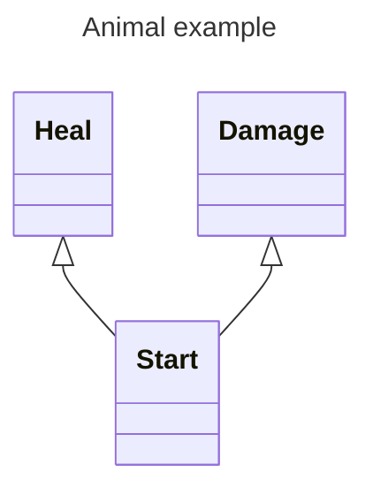

[Go back to classes](../classes.md)
# Doctor
Doctors are an odd breed. Not many of them exist and most that do are military doctors in the empire's armies. 

### Hit dice: 1d8 1 per level

### Proficiencies:
Armor: Light armor 
Weapons: Simple weapons 
Saving Throws: Constitution, Wisdom 
Skills: Medicine and choose two from: Animal Handling, Deception, Insight, Nature, Survival

### Equipment
Doctors cane(A special cane made for you, on the top is the head of an animal of your choosing). The cane functions as an quarterstaff.
Any simple weapon
Leather armor

### Abilities
The doctor will make use of a skilltree. Every level you unlock 1 ability. Every third level you can take two abilities.  
Abilities that are behind other abilities in the tree can only be unlocked if the ability before it is already unlocked. If an ability is behind two other abilities, not both abilities have to be unlocked to gain access to this one. 

### Skilltree
