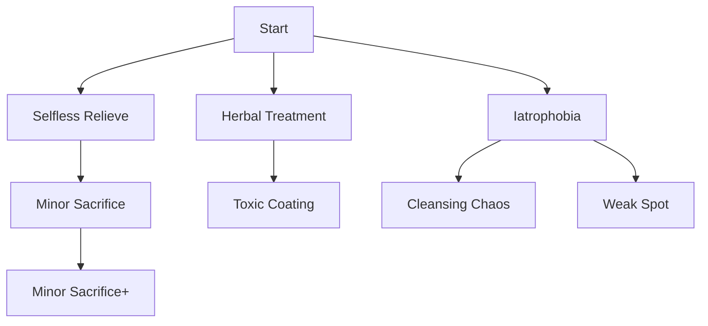

[Go back to classes](../classes.md)
# Doctor
Doctors are an odd breed. Not many of them exist and most that do are military doctors in the empire's armies. 

### Hit dice: 1d8 1 per level

### Proficiencies:
Armor: Light armor 
Weapons: Simple weapons 
Saving Throws: Constitution, Wisdom 
Skills: Medicine and choose two from: Animal Handling, Deception, Insight, Nature, Survival

### Equipment
Doctors cane(A special cane made for you, on the top is the head of an animal of your choosing). The cane functions as an quarterstaff.
Any simple weapon
Leather armor

### Abilities
The doctor will make use of a skilltree. Every level you unlock 1 ability. Every third level you can take two abilities.  
Abilities that are behind other abilities in the tree can only be unlocked if the ability before it is already unlocked. If an ability is behind two other abilities, not both abilities have to be unlocked to gain access to this one. 

### Skilltree

## Herbal treatment
You can during a short rest prepare 2 portions of an ointment. This can as an bonus-action be smeared onto a wound(of an ally if next to you) healing 1d4+WIS

## Selfless relieve
During a short rest you can help your party recover. You can sacrifice your own hit die, for every die sacrificed you can have a party member their hit die be max.

## Minor sacrifice
During someone elses turn you can sacrifice some of your own HP. You spend your level times two HP. The player whose turn it is receives +1 on to-hit and +1d4 on damage.

## Minor sacrifice+
The result of minor sacrifice becomes +2 on to-hit and +1d6 on damage.

## Iatrophobia
You can ignite a fire in the eyes of the animal on your cane. When doing this and looking directly at an enemy they have to roll a wisdom saving throw. DC = 8+PROF+WIS. On a fail they become frightened of you.

## Cleansing chaos
By tapping your cane on the ground in a certain way a set of bells will sound. Everyone(including you) in a 30ft radius will be freed from the following conditions if they had them: Blinded, Charmed, Deafened, Frightened, Paralyzed(They'll still be incapacitated for another round). If used more than once per long rest everyone(including you) will have to roll a constitution saving throw. If failed the damage is 2d4+WIS psychic, if succeeded it is halved. 
The DC is 10+WIS+X. X will start at 1 and double for every use within the long rest.

## Weak spot
When attacking and your to-hit roll is 2 above the AC of the enemy you can roll an additional 1d4 damage. So for example, AC=12 and you roll a 14, then this counts, a 13 does not.

## Toxic coating
During your career you have developed knowledge about the toxic substances and their effect. You can coat up to 3 piercing and slashing weapons in poison during a short rest. Poison sticks onto a weapon for 5 hits. Every hit with a poisoned weapon deals +1d4 damage, a poisoned enemy takes half of this damage at the start of each round for of maximum of 3 rounds unless healed earlier. Only two weapons can be poisoned during a long rest.