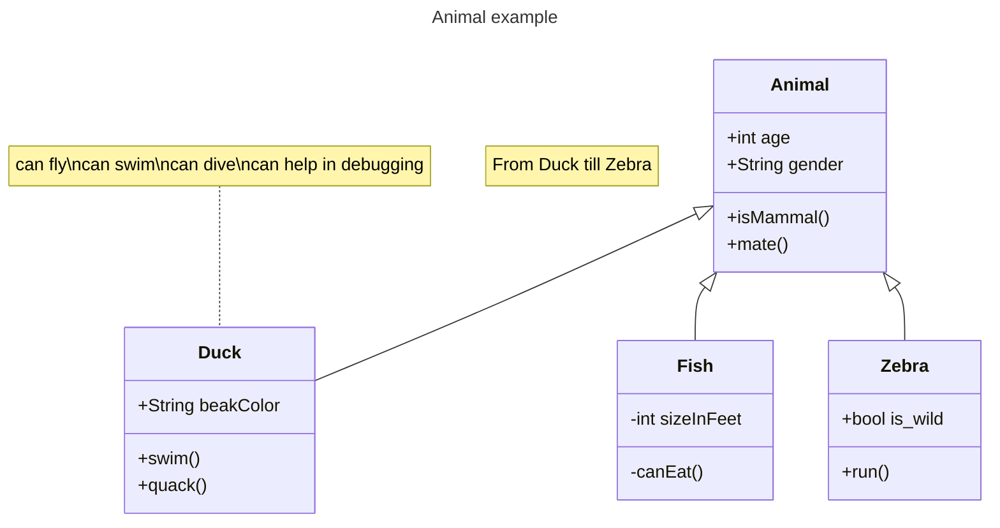

[Go back to classes](../classes.md)
# Doctor
Doctors are an odd breed. Not many of them exist and most that do are military doctors in the empire's armies. 

### Hit dice: 1d8 1 per level

### Proficiencies:
Armor: Light armor 
Weapons: Simple weapons 
Saving Throws: Constitution, Intelligence 
Skills: Medicine and choose two from: Animal Handling, Deception, Insight, Nature, Survival

### Abilities
The doctor will make use of a skilltree. Every uneven level you can unlock two abilities in the skilltree, every even level you can unlock one ability.  
Abilities that are behind other abilities in the tree can only be unlocked if the ability before it is already unlocked. If an ability is behind two other abilities, not both abilities have to be unlocked to gain access to this one. 

### Skilltree
